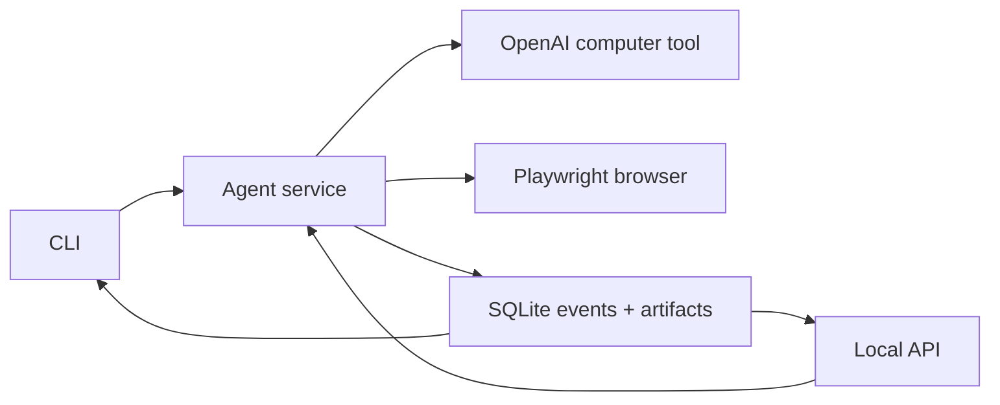

# computer-using-agent

TypeScript-first playground for local, human-in-the-loop computer-use agents.

## About

This repo is for agents that interact with a browser through screenshots, UI actions, approvals, and trace logs.

The goal is not unsupervised autonomy. The goal is a small local loop that can look at a screen, ask the model for the next UI action, pause when the next step is risky, and leave a useful audit trail.

## MVP Shape

The current MVP is CLI-first:

- one local browser session at a time
- Playwright as the browser harness
- SQLite plus local screenshot artifacts for persistence
- append-only session events with a projected session state
- explicit `approve` and `reject` commands for risky action batches
- JSON export for debugging and replay

The dashboard is a secondary local control surface. It should compile, but the CLI is the acceptance path for this phase.

## Quick Start

```bash
npm install
npm run cli --workspace @cua/agent -- start "click the mock button"
```

By default, the CLI uses a fake model and fake browser so the approval loop can run without API calls or a real browser.

```bash
npm run cli --workspace @cua/agent -- list
npm run cli --workspace @cua/agent -- approve <sessionId>
npm run cli --workspace @cua/agent -- reject <sessionId> "not safe"
npm run cli --workspace @cua/agent -- resume <sessionId>
npm run cli --workspace @cua/agent -- watch <sessionId>
npm run cli --workspace @cua/agent -- export <sessionId>
```

Run the optional local API and dashboard:

```bash
npm run dev
```

The API listens on `http://127.0.0.1:4317`.
The dashboard listens on `http://127.0.0.1:5173`.

## Real Mode

Real mode uses OpenAI's GA computer-use flow with `gpt-5.4` and `tools: [{ type: "computer" }]`.

```bash
npx playwright install chromium
OPENAI_API_KEY=... npm run cli --workspace @cua/agent -- start "open a harmless local browser task" --real
```

The default real-mode settings are:

- `CUA_MODEL=gpt-5.4`
- `CUA_REASONING_EFFORT=xhigh`
- `CUA_DATA_DIR=.cua-data`
- `CUA_REAL_MODE=0`
- `CUA_ALLOW_DOMAINS=`
- `CUA_DENY_DOMAINS=`
- `CUA_START_URL=about:blank`

Set `CUA_COMPUTER_USE_MODE=preview` only if you need the older `computer-use-preview` compatibility path.

## Safety Boundary

The local browser is the execution boundary. The model proposes computer actions; this repo executes them only after the local policy allows the batch or the user approves it.

The agent pauses for risky steps such as typing, clicking, keypresses, unknown actions, denied domains, and model-reported safety checks. Use narrow tasks and harmless local fixtures while developing.

## Architecture



## Development

```bash
npm run check
npm test
npm run build
```

Browser executor tests are opt-in because they require local Playwright browser binaries:

```bash
CUA_RUN_BROWSER_TESTS=1 npm test
```

## License

MIT. See [LICENSE](./LICENSE).
