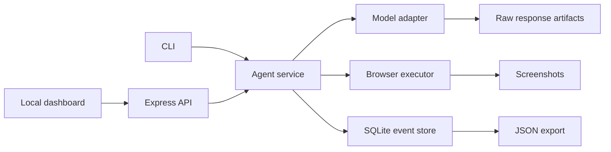

# computer-using-agent

TypeScript-first playground for local, human-in-the-loop computer-use agents.

## About

`computer-using-agent` is a local-first experiment for building apps on top of OpenAI computer-use models. It runs an agent loop that can look at a browser screenshot, ask a model for the next UI actions, execute those actions through Playwright, pause when a step is risky, and keep a trace that can be inspected or exported.

The goal is not unsupervised autonomy. The goal is a small, inspectable harness for building approval-gated workflows where a human stays in charge of state-changing steps.

OpenAI references:

- [Computer use guide](https://developers.openai.com/api/docs/guides/tools-computer-use)
- [GPT-5.4 model page](https://developers.openai.com/api/docs/models/gpt-5.4)
- [Models overview](https://developers.openai.com/api/docs/models)

## Current Status

The repo currently ships a CLI-first MVP:

- TypeScript npm workspace.
- Shared core types for sessions, trace events, browser snapshots, approvals, and computer actions.
- Agent service with a turn-based model/browser/session loop.
- OpenAI Responses adapter targeting `gpt-5.4` with the `computer` tool in real mode.
- Optional `computer-use-preview` compatibility mode.
- Playwright browser executor with a persistent per-session Chromium context.
- SQLite session store using append-only events plus a projected session row.
- Screenshot and raw-model-response artifacts under the local data directory.
- CLI commands for `start`, `resume`, `approve`, `reject`, `watch`, `list`, and `export`.
- Local Express API and Vite/React dashboard as a secondary control surface.
- Workflow catalog with a `food-order` fixture demo.
- Fake model and fake browser defaults for tests and no-API local development.

The next planned layer is more workflow packs: curated demos such as form filling and web QA that sit above the generic task runner.

## What This Is Not

This repo is not a hosted remote-control product. It is not multi-user. It does not try to bypass approvals, log into real accounts automatically, or complete purchases without a human in the loop.

For now, keep real tasks harmless and narrow. Use local fixtures for demos before trying real websites.

## Requirements

- Node.js 22 or newer.
- npm 10 or newer.
- Playwright Chromium for real browser mode.
- `OPENAI_API_KEY` only when running real model mode.

The project uses Node's built-in SQLite bindings, so modern Node 22 is expected.

## Quick Start

Install dependencies:

```bash
npm install
```

Run the mock approval loop:

```bash
npm run cli --workspace @cua/agent -- start "click the mock button"
```

The default mode uses a fake model and fake browser. It still exercises the session store, trace events, approval pause, and export path without calling OpenAI or launching Chromium.

Approve the pending mock action:

```bash
npm run cli --workspace @cua/agent -- approve <sessionId>
```

Export the session:

```bash
npm run cli --workspace @cua/agent -- export <sessionId>
```

## CLI

Current commands:

```bash
npm run cli --workspace @cua/agent -- serve [--real]
npm run cli --workspace @cua/agent -- start "task" [--real]
npm run cli --workspace @cua/agent -- resume <sessionId> [--real]
npm run cli --workspace @cua/agent -- list
npm run cli --workspace @cua/agent -- approve <sessionId> [--real]
npm run cli --workspace @cua/agent -- reject <sessionId> [reason]
npm run cli --workspace @cua/agent -- watch <sessionId>
npm run cli --workspace @cua/agent -- export <sessionId>
npm run cli --workspace @cua/agent -- workflow list
npm run cli --workspace @cua/agent -- workflow describe <workflowId>
npm run cli --workspace @cua/agent -- workflow start <workflowId> [--mode fixture|browse|real] [--input key=value] [--real]
npm run cli --workspace @cua/agent -- workflow export <sessionId>
```

Typical local loop:

```bash
npm run cli --workspace @cua/agent -- start "open the page and summarize what you see"
npm run cli --workspace @cua/agent -- watch <sessionId>
npm run cli --workspace @cua/agent -- approve <sessionId>
npm run cli --workspace @cua/agent -- export <sessionId> > run.json
```

`watch` prints new trace events until the session reaches a terminal state: `completed`, `failed`, `blocked`, or `rejected`.

## Workflow Packs

Workflow packs are curated task templates on top of the generic browser agent. They provide typed inputs, task prompts, safety expectations, and optional fixture pages.

List workflows:

```bash
npm run cli --workspace @cua/agent -- workflow list
```

Describe the food-ordering demo:

```bash
npm run cli --workspace @cua/agent -- workflow describe food-order
```

Start the local fake food-ordering workflow:

```bash
npm run cli --workspace @cua/agent -- workflow start food-order --mode fixture --input cuisine=thai --input budget=30 --input servings=2
```

Run it with the real model against the local fixture:

```bash
OPENAI_API_KEY=... npm run cli --workspace @cua/agent -- workflow start food-order --mode fixture --real
```

The `food-order` fixture is an Uber Eats-style local page with fake restaurants, fake menu items, and a fake checkout review. It exists so demos can exercise browsing, comparison, cart changes, screenshots, approvals, and export without touching a real account or real payment flow.

Real or browse mode can point at a public site, but those modes are browse-first and approval-gated. Do not use real accounts, checkout credentials, or real purchase flows while this project is still in MVP shape.

## Real Mode

Install Chromium:

```bash
npx playwright install chromium
```

Run a real model/browser session:

```bash
OPENAI_API_KEY=... npm run cli --workspace @cua/agent -- start "open a harmless local browser task" --real
```

Useful real-mode settings:

```bash
OPENAI_API_KEY=...
CUA_REAL_MODE=1
CUA_MODEL=gpt-5.4
CUA_REASONING_EFFORT=xhigh
CUA_START_URL=https://example.com
CUA_ALLOW_DOMAINS=example.com
npm run cli --workspace @cua/agent -- start "inspect the page title" --real
```

Set `CUA_COMPUTER_USE_MODE=preview` only when you explicitly want the older `computer-use-preview` compatibility path.

## Configuration

Public-safe environment variables:

| Variable | Default | Purpose |
| --- | --- | --- |
| `OPENAI_API_KEY` | empty | Required only for real OpenAI mode. |
| `CUA_MODEL` | `gpt-5.4` | Model used by the real OpenAI adapter. |
| `CUA_REASONING_EFFORT` | `xhigh` | Reasoning effort passed to the model adapter. |
| `CUA_REAL_MODE` | `0` | Enables real mode when set to `1`; `--real` also works. |
| `CUA_COMPUTER_USE_MODE` | `ga` | Use `ga` for the `computer` tool or `preview` for compatibility. |
| `CUA_DATA_DIR` | `.cua-data` | Local SQLite database, screenshots, raw responses, and browser profiles. |
| `CUA_PORT` | `4317` | Local API port. |
| `CUA_START_URL` | `about:blank` | Initial page for new Playwright sessions. |
| `CUA_ALLOW_DOMAINS` | empty | Comma-separated domain allowlist. |
| `CUA_DENY_DOMAINS` | empty | Comma-separated domain denylist. |

Copy `.env.example` if you want a local env file:

```bash
cp .env.example .env
```

Do not commit `.env`, databases, screenshots, browser profiles, or exports that contain private task data.

## Local API And Dashboard

Start the API and dashboard together:

```bash
npm run dev
```

Defaults:

- API: `http://127.0.0.1:4317`
- Dashboard: `http://127.0.0.1:5173`

Current API routes:

```text
GET  /api/health
GET  /api/sessions
POST /api/tasks
GET  /api/sessions/:sessionId
POST /api/sessions/:sessionId/approve
POST /api/sessions/:sessionId/resume
POST /api/sessions/:sessionId/reject
GET  /api/sessions/:sessionId/export
GET  /api/workflows
GET  /api/workflows/:workflowId
POST /api/workflows/:workflowId/start
GET  /api/fixtures/:workflowId
GET  /api/artifacts/:sessionId/...
```

The dashboard is intentionally thin right now. It can start generic tasks, launch workflow sessions, list sessions, show the latest screenshot, render the event trace, and approve or reject a pending batch.

## Safety Model

The model proposes actions. The local harness decides whether to execute them.

The current policy pauses for:

- model-marked sensitive actions
- unknown actions
- clicks and double-clicks
- typing
- keypresses
- drags
- denied domains
- domains outside the allowlist when an allowlist is configured
- OpenAI safety checks returned by the model adapter

The approval command executes exactly the persisted pending action batch. Rejecting a session records the reason and does not execute the pending batch.

This is an approval gate, not a complete security sandbox. Real browser sessions can interact with real websites, so keep allowlists tight and use local fixtures for destructive or purchase-like workflows.

## Data And Exports

By default, local state is stored under `.cua-data`:

```text
.cua-data/
  sessions.sqlite
  artifacts/
    <sessionId>/
      screenshots/
      model/
  browser/
    <sessionId>/
```

The SQLite database stores:

- append-only session events
- latest projected session state

Artifacts store:

- browser screenshots
- raw model responses
- per-session Playwright user data

Export returns a JSON bundle with the projected session, event log, artifact base path, and export timestamp. Treat exports as potentially sensitive if the task involved real websites.

## Architecture



Workspace layout:

```text
packages/core      shared types, reducer, approval policy, export serialization
packages/agent     service loop, CLI, API, model/browser adapters, persistence
apps/dashboard     local React control surface
```

The important seams are intentionally narrow:

- `ModelClient` turns task plus browser state into an outcome.
- `BrowserExecutor` opens a session, captures screenshots, and executes action batches.
- `SessionStore` appends events, saves artifacts, and reconstructs sessions.

## Development

Run checks:

```bash
npm run check
npm test
npm run build
```

Run optional browser tests:

```bash
CUA_RUN_BROWSER_TESTS=1 npm test
```

The default tests use fake adapters and should not call OpenAI or launch a real browser.

## Roadmap

Planned follow-ups:

- `form-fill-fixture`: fill a local multi-step form and pause before final submit.
- `web-qa-fixture`: navigate a fixture page, verify expected UI state, and export screenshots.

Larger deferred ideas:

- streamed dashboard events instead of polling
- richer session replay and artifact viewer
- stricter checkpoint policies per workflow
- hosted control plane with authentication
- packaged desktop shell

## Contributing Notes

Keep public docs boring and safe:

- no secrets
- no private account data
- no real payment or address examples
- no local machine-specific paths
- keep public docs self-contained

Prefer local fixtures for demos and tests. Any workflow that can spend money, submit forms, upload files, download files, or mutate a real account must pause before the risky step.

## License

MIT. See [LICENSE](./LICENSE).
