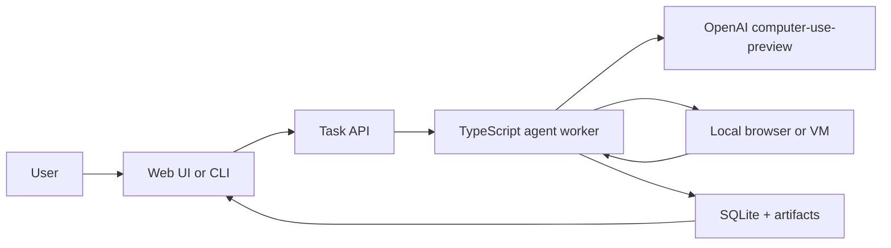

# computer-using-agent

TypeScript-first playground for building human-in-the-loop apps on top of OpenAI's computer-use preview tooling.

## About

This repo is for agents that interact with screens, browsers, and desktop workflows that are too annoying, too repetitive, or too brittle to keep doing by hand.

The point is not "fully autonomous magic." The point is a useful control loop with explicit approvals, trace logs, screenshots, and a sane escape hatch when the model gets weird.

## Why TypeScript

TypeScript is the clean default here because the product naturally wants a web UI, browser automation, and a control plane that can all live in the same ecosystem.

That said, the runtime can still be shaped a few ways:

- CLI-first for the fastest smoke tests
- Local web app for task submission, approvals, and trace review
- Desktop shell later if we want something more polished

A pure hosted website cannot directly take over your computer by itself. If we want "control my computer through a website," the website becomes the front end and a local agent or remote VM does the actual computer work.

## Suggested Architecture

## Core Pieces

- Task input
- Approval checkpoints
- Screenshot timeline
- Action trace
- Retry / rollback boundaries
- Allowlist / denylist
- Session export

## MVP Spec

### 1. CLI runner

Start with a command-line loop that can:

- accept a task prompt
- launch a browser session
- call the model
- execute the returned action
- capture the next screenshot
- stop for approval before sensitive actions

### 2. Local dashboard

Add a local web UI that can:

- show the current task
- display screenshots and action history
- approve or reject the next step
- export logs
- retry from a checkpoint

### 3. Safer automation modes

Later, add modes like:

- watch-only
- approve-before-submit
- trusted-site automation
- regression/QA runs

## Design Principles

- Keep the human in the loop for anything destructive, expensive, or irreversible
- Log every meaningful step so failures are debuggable
- Prefer narrow prompts and explicit state over clever autonomy
- Treat preview APIs as moving targets and design for change
- Make the first version boring enough to trust

## Build Constraint

OpenAI's computer-use guide says `computer-use-preview` is a specialized model for the computer use tool, usable only through the Responses API, and recommends browser-based tasks plus human oversight for risky flows. This repo should lean into approvals, traceability, and a local execution environment instead of pretending the agent can run unsupervised.

## Brainstorming Directions

See [BRAINSTORM.md](./BRAINSTORM.md) for the first product directions and safety posture.

## License

MIT. See [LICENSE](./LICENSE).
